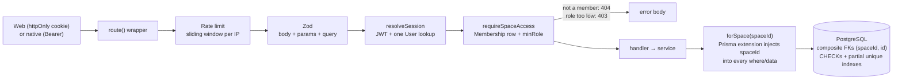

# monKey

Personal and shared finance tracking for a household. Mobile-first PWA on top of a multi-tenant REST API, self-hosted on a single VPS.

## Why this exists

I wanted one place where two people can record what they spend from shared and individual accounts, see who owes whom without turning every dinner into a debt record, and get monthly numbers that stay correct after the fact. Off-the-shelf apps either don't share, don't handle multiple currencies honestly, or keep the data somewhere I don't control.

Two constraints shaped the design. First, the data of one household must never leak into another, even when the code has bugs — isolation is enforced in the data layer and in the database, not in request handlers. Second, the app is used with EUR and ARS side by side, so every amount is an integer in minor units with its ISO 4217 code next to it, and every conversion is frozen at write time so historical reports never drift.

It is a project I built for my own use and keep developing. Deployment target is a single VPS with Docker Compose; the image runs migrations before it accepts traffic.

## Features

- **Shared Spaces with roles.** A Space is personal or shared. Members are OWNER / ADMIN / MEMBER / VIEWER, invited by email with expiring tokens. Every domain endpoint declares its minimum role.
- **Accounts, transactions, transfers, budgets.** Multi-currency accounts; income/expense with categories, tags and attachments (receipts as JPEG/PNG/WebP/HEIC/PDF, validated by magic bytes); two-legged transfers that are net-zero by construction; budgets per category, optionally restricted to specific accounts, with rollover.
- **Expense splitting and settlements.** A split is an annotation on a transaction, not a debt row. Balances between members are aggregated on read and the app suggests the minimal set of payments to settle up.
- **Recurring rules materialized by a cron job.** Rent on the 1st, salary on the last Friday. Missed occurrences are backfilled with their real dates; the job is idempotent at the database level.
- **Savings goals and debts.** Goals track contributions (optionally linked to real transfers) and show reserved vs. available balance per account. Debts record what was agreed and what was paid; no amortization guessing.
- **Reports, CSV import/export, audit log.** Monthly series, category and member breakdowns, month-over-month comparison. CSV import previews with the same code path that writes. Membership changes and destructive actions are audited inside the same transaction as the change.

## Architecture

Next.js App Router serves both the REST API (`src/app/api/v1/**`) and the web UI (`src/app/(app)/**`). The UI talks to the API with `fetch` like any other client — no Server Actions, no direct Prisma access from components — so a native client can reuse the backend and the contracts in `src/shared/**` as they are.

```
src/
├── shared/            Contracts (Zod), money, dates, recurrence, split maths.
│                      Pure TypeScript: no Next, React or Prisma imports (lint + arch test).
├── server/
│   ├── db/            The only place that sees PrismaClient. forSpace(spaceId), systemClient(), raw SQL for reports.
│   ├── auth/          argon2id, JWT (jose), session resolution from cookie or Bearer.
│   ├── api/           route() wrapper, error mapping, authorization, rate limiting, routes manifest.
│   ├── services/      Business logic as functions that receive their dependencies.
│   ├── mail/          console | smtp | resend drivers behind one interface.
│   └── storage/       Local-disk driver behind one interface (attachments).
├── app/
│   ├── api/v1/        Route handlers. One line of glue each: schema + role + service call.
│   ├── (app)/         Authenticated UI (dashboard, transactions, budgets, goals, debts, reports, settings).
│   ├── (auth)/        Login, register, verify, reset, invitation acceptance.
│   └── sw.ts          Service Worker source (built separately by Serwist).
├── lib/               Typed API client, TanStack Query hooks, SW bridge.
└── tests/
    ├── unit/          Pure logic. 17 files.
    ├── arch/          Rules checked against the source tree and schema.prisma. 3 files.
    └── integration/   Real Postgres: isolation, role matrix, every domain module. 17 files.
```

### Request pipeline

Every API endpoint goes through the same wrapper, in the same order. Declaring `space: { minRole }` forces the handler to have a `spaceId` in the path and hands it a database client that is already scoped.



### Rules the toolchain enforces

These are not conventions. Breaking them fails `pnpm check`.

1. The unscoped `PrismaClient` is importable only from `src/server/db/**` (ESLint `no-restricted-imports`). Everything else uses `forSpace(spaceId)` or the deliberately loud `systemClient()`.
2. `src/shared/**` cannot import Next, React, Prisma or anything from `src/server`.
3. `process.env` is read only in process entry points; the rest of the code uses `env`, validated with Zod at startup ([src/env.schema.ts](src/env.schema.ts)). Production refuses to boot with `http://` in `APP_URL`, the `console` mail driver, or no `CRON_SECRET`.
4. [db-scope-coverage.test.ts](src/tests/arch/db-scope-coverage.test.ts) parses `schema.prisma` and fails if a model with `spaceId` is not classified for the scope extension, or if a relation between two scoped models does not use a composite foreign key.
5. [routes-manifest.test.ts](src/tests/arch/routes-manifest.test.ts) walks `src/app/api/**` and fails if any exported HTTP method is missing from [routes.manifest.ts](src/server/api/routes.manifest.ts). The manifest drives the role matrix and the isolation suite, so a new endpoint cannot skip either.
6. [source-rules.test.ts](src/tests/arch/source-rules.test.ts) re-checks rules 1–3 on the source text, because an ESLint rule can be disabled with a comment. It also confines `$queryRaw` to `src/server/db/raw/`.

### Domain invariants in the database

- Money is `BigInt` in minor units plus a `CHAR(3)` currency; amounts are always positive and the sign comes from `type` (CHECK). On the wire amounts are strings — `JSON.stringify` cannot serialize `bigint` and `number` loses precision past 2^53.
- Cross-currency transactions store `exchangeRateSnapshot` and `amountPrimaryMinor` at write time. Reports aggregate `COALESCE(amountPrimaryMinor, amountMinor)` and never convert with today's rate.
- Transfers are two `TRANSFER` rows sharing a `transferGroupId`; a partial unique index allows one leg per direction, a CHECK forbids a category on transfers, and both legs get the same primary-currency amount so net worth does not move.
- Economic dates are `DATE` (no time, no zone); system timestamps are `timestamptz`. "I spent this on August 3rd" is a calendar fact, not an instant.
- Tokens (refresh, verification, reset, invitation) are stored as SHA-256 hashes only.

## Stack

- **Runtime:** Node 24, TypeScript 6 (`strict`, `noUncheckedIndexedAccess`, `verbatimModuleSyntax`), pnpm 11.
- **Web:** Next.js 16 (App Router, Turbopack, `output: "standalone"`), React 19, Tailwind CSS 4, shadcn/ui on Radix, TanStack Query 5, Recharts, next-themes.
- **API and domain:** Next route handlers, Zod 4 contracts shared with the client, pino logging.
- **Data:** PostgreSQL 17, Prisma 7 with the `pg` driver adapter (no Rust engine), versioned SQL migrations (15 so far), 23 models.
- **Auth:** argon2id via `@node-rs/argon2`, HS256 JWT via `jose`, rotating opaque refresh tokens.
- **PWA:** Serwist 9 in configurator mode, generated icons and iOS splash screens via `sharp`.
- **Mail:** nodemailer (SMTP / Mailpit in dev) or Resend, selected by env.
- **Tooling:** Vitest 4 (unit, architecture, integration), ESLint 9 with `typescript-eslint` strict type-checked presets, Prettier, Docker multi-stage build.

## Technical decisions

### 1. Tenant isolation that survives buggy code

**Problem.** Every financial table hangs off a `spaceId`. The usual approach — remembering to add `where: { spaceId }` in every query — fails the first time someone forgets, and the failure is silent: the other household's data just shows up.

**Solution.** Three independent layers, each tested on its own ([space-scope.ts](src/server/db/space-scope.ts), [schema.prisma](prisma/schema.prisma), [space-isolation.test.ts](src/tests/integration/space-isolation.test.ts)):

1. A Prisma client extension wraps every operation on every model. Scoped models get `spaceId` injected into `where` (AND-ed, so a hand-written foreign `spaceId` yields zero rows, not foreign rows) and into `data` on create. `Space` itself is scoped by its own primary key. Identity models (`User`, `RefreshToken`, `VerificationToken`) throw if touched through a scoped client. An unclassified model throws instead of passing through. Updates that try to change `spaceId` throw.
2. Every relation between two scoped models is a composite foreign key `(spaceId, id)`, with `@@unique([spaceId, id])` on the target. The extension guarantees a row is born in the right Space but does not validate IDs coming from a request body; the composite FK turns "transaction in Space A pointing at an account in Space B" into a PostgreSQL error.
3. `requireSpaceAccess` is the only function that turns a path `spaceId` into a permission. It answers 404 for non-members — a 403 would confirm the Space exists — and reserves 403 for members whose role is too low.

**Trade-offs.** Nested `include`/`select` do not pass through the extension; they are safe only because of the composite FKs, and they can return soft-deleted rows. Join tables (`TransactionTag`, `BudgetAccount`) carry a denormalized `spaceId` so the invariant "every domain table has spaceId" holds without exceptions. Composite FKs cannot use `ON DELETE SET NULL` (Postgres would null the `spaceId` column too), so those relations use `RESTRICT` and the domain relies on soft delete. Raw SQL (needed for `date_trunc` in monthly reports, which Prisma's `groupBy` cannot express) bypasses the extension entirely, so it is confined to one directory, takes `spaceId` as the first parameter, and is covered by report isolation tests.

### 2. An idempotent, backfilling job for recurring transactions

**Problem.** A cron hits `POST /api/v1/jobs/recurring` once a day. Cron jobs get retried, run twice, or don't run for three weeks because the VPS was down. The naive implementations either duplicate rent when triggered twice or, after downtime, create one transaction dated today, putting January's rent in March's report.

**Solution** ([materialize.ts](src/server/services/recurring/materialize.ts), [recurrence.ts](src/shared/recurrence.ts)):

- All overdue occurrences are materialized, each with its own calendar date. The date is an economic fact, not the time a process ran.
- Idempotency lives in the database: a partial unique index on `(spaceId, recurringRuleId, date)` plus `createMany({ skipDuplicates: true })`. Firing the job twice is harmless.
- One database transaction per rule: the new transactions and the rule's `nextRunDate` advance together. If they were saved separately and the process died in between, the rule would retry the same dates forever (rejected by the index, but never advancing). A rule that fails — no exchange rate loaded for that date, for example — is counted and the sweep continues with the rest.
- A cap of 60 occurrences per rule per run bounds the size of a recovery transaction; the remainder is reported as `truncated` and picked up next run. Rules are paginated by id cursor, not offset, because the sweep mutates the set it iterates.
- Occurrences are computed from the anchor date, never from the previous occurrence. Chained month arithmetic would move "every month on the 31st" to the 28th after February and leave it there.
- The dashboard runs the same function scoped to one Space before rendering, so today's rent appears in "to confirm" even if no cron is configured.

**Trade-offs.** The job's "today" is UTC, not each Space's timezone; the difference is at most one day and the next run corrects it. The per-run cap means a daily rule that was down for six months takes three runs to catch up. The endpoint authenticates with a shared secret compared in constant time rather than a session, because no user is behind it.

### 3. Sessions: short JWTs, rotating refresh tokens, immediate revocation

**Problem.** Stateless JWTs make "log out everywhere" and password reset take effect only when the token expires. Long-lived refresh tokens in a database are a liability if the database leaks, and a stolen refresh token is indistinguishable from the real one.

**Solution** ([sessions.ts](src/server/services/auth/sessions.ts), [session.ts](src/server/auth/session.ts), [tokens.ts](src/server/auth/tokens.ts)):

- Access token: 15-minute HS256 JWT carrying the user id and a session id. Refresh token: 32 random bytes, 60 days, stored only as SHA-256, rotated on every use inside a transaction.
- Reuse detection: presenting a refresh token that has already been rotated means two parties hold the same chain. Every session of that user is revoked, because there is no way to tell which party is legitimate.
- `User.sessionsRevokedAt` is compared against each access token's `iat` on every request. Password reset and "revoke all" take effect immediately, not at expiry.
- Login runs argon2id against a dummy hash when the email does not exist, so response time does not reveal which accounts are real. Per-IP limits are a sliding window in memory; per-account lockout (8 failures → 15 minutes) is in the `User` row because a brute-force attempt against one account has to survive a redeploy.
- Web clients get httpOnly `Secure` cookies; native clients send `X-Client-Type: native` and receive tokens in the body. One `resolveSession` handles both.
- The client de-duplicates refreshes: five queries failing with 401 after the app returns from background trigger one refresh, not five rotations — four of which would look like reuse and log the user out.

**Trade-offs.** Session resolution does one primary-key lookup per request, so it is not fully stateless; the lookup returns timezone, locale and verification state that most endpoints need anyway. The in-memory rate limiter resets on deploy and is per-process, which is acceptable for one container and would need Redis behind the existing interface for several.

### 4. A Service Worker that cannot serve another user's data

**Problem.** An installable PWA needs runtime caching of API responses to be usable on a bad connection. The classic bug is a cached response from user A or Space A surfacing after switching to B — on a shared device, with shared households, this is a data leak.

**Solution** ([sw.ts](src/app/sw.ts), [sw-bridge.ts](src/lib/sw-bridge.ts)):

- `GET /api/v1/spaces/:spaceId/**` is network-first (balances that look current but aren't are worse than a spinner) into a cache named per Space. Switching Spaces cannot read the other cache by construction.
- The client tells the worker who is logged in and sends a purge message on logout and on Space switch, before navigating. Everything under `/me`, `/auth` and `/spaces` (the endpoints that define who you are) is never cached.
- Each cached response is stamped with the user id that requested it. On a cache hit, a mismatch with the current user deletes the entry and goes to the network. This covers the case where the purge message never arrived because the worker was asleep.
- Every activation of a new worker version purges the API caches, since a deploy can change response shapes.
- Precache is the app shell only (CSS, fonts, `/offline`, manifest — around 70 kB). JavaScript chunks are cache-first at runtime because their names are content-hashed.

**Trade-offs.** A screen never visited does not work offline; the alternative was 3 MB of precache on first install over mobile data. There is no offline write queue — the offline page says so. Serwist runs in configurator mode as a separate build step after `next build`, because its webpack plugin would force the whole build off Turbopack; the side effect is that development has no Service Worker at all, and the app actively unregisters any leftover production worker on `localhost`.

## Local setup

Prerequisites: Node ≥ 24, pnpm 11 (`corepack enable`), Docker.

```bash
pnpm install
cp .env.example .env          # then set AUTH_SECRET (see below)
pnpm docker:up                # Postgres (dev + test) and Mailpit
pnpm db:migrate
pnpm db:seed                  # optional: three users and a shared Space
pnpm dev
```

Generate `AUTH_SECRET` with a cryptographic source, e.g. `openssl rand -base64 48`.

| Service                        | Address               |
| ------------------------------ | --------------------- |
| App                            | http://localhost:3000 |
| Mailpit (outgoing mail in dev) | http://localhost:8025 |
| Postgres (dev)                 | localhost:5442        |
| Postgres (tests)               | localhost:5443, tmpfs |

### Environment variables

Validated with Zod at startup; the process refuses to boot on invalid config. Names only — see [.env.example](.env.example) for comments and defaults.

```
NODE_ENV  APP_URL  LOG_LEVEL
DATABASE_URL
AUTH_SECRET  ACCESS_TOKEN_TTL_MINUTES  REFRESH_TOKEN_TTL_DAYS
EMAIL_VERIFICATION_TTL_HOURS  PASSWORD_RESET_TTL_MINUTES  INVITATION_TTL_DAYS
MAIL_DRIVER  MAIL_FROM  RESEND_API_KEY
SMTP_HOST  SMTP_PORT  SMTP_USER  SMTP_PASSWORD  SMTP_SECURE
DEFAULT_LOCALE  DEFAULT_CURRENCY  DEFAULT_TIMEZONE
STORAGE_DRIVER  STORAGE_LOCAL_DIR
CRON_SECRET
RATE_LIMIT_ENABLED
```

Required without a default: `DATABASE_URL`, `AUTH_SECRET`. Required in production: `CRON_SECRET`, an `https` `APP_URL`, and a real mail driver.

### Commands

| Command                 | What it does                                                        |
| ----------------------- | ------------------------------------------------------------------- |
| `pnpm check`            | typecheck + lint + format check + unit/arch tests                   |
| `pnpm test`             | Unit and architecture tests, no database (20 files, 402 tests)      |
| `pnpm test:integration` | Integration tests against the tmpfs Postgres (17 files, ~400 cases) |
| `pnpm db:migrate`       | Create and apply a migration in development                         |
| `pnpm db:deploy`        | Apply committed migrations (what the Docker image runs at start)    |
| `pnpm user:create`      | Create a verified first user without going through email            |
| `pnpm pwa:assets`       | Regenerate icons and iOS splash screens from the logo               |
| `pnpm build`            | `prisma generate` + `next build` + `serwist build`                  |

`prisma db push` is never used; every schema change is a committed migration.

### Production

```bash
cp .env.example .env.production   # fill in real values
docker compose -f docker-compose.prod.yml up -d --build
```

The image is multi-stage (deps → build → runtime), runs as a non-root user, copies only the standalone output, and executes `prisma migrate deploy` before `node server.js`. Postgres is not published to the host. Put a reverse proxy in front for TLS. Schedule the recurring job:

```
15 3 * * * curl -fsS -X POST -H "Authorization: Bearer $CRON_SECRET" https://<host>/api/v1/jobs/recurring
```

## Project status

Actively developed; the latest changes are UX fixes to goals and transaction editing (late August 2026). The three planned phases — core domain and auth, analysis (budgets, reports, transfers, recurring), and goals/debts/import/attachments/splitting — are implemented and covered by integration tests.

Known gaps, as of the code today:

- No offline write queue. Reads work offline for visited screens; writes require a connection.
- Attachments have a single storage driver (local disk behind an interface). S3-compatible storage would be a new driver, not a domain change.
- Exchange rates are entered manually. The provider interface exists; no automatic source is wired in.
- The per-IP rate limiter is in-process memory. Fine for one container; multi-replica needs a Redis implementation of the same interface.
- `/api/health` is a liveness probe only; there is no readiness check that touches the database.
- UI copy is Spanish only. Locale and timezone are per user, but they drive formatting, not translation.
- No hosted CI pipeline is committed; `pnpm check` is the gate and runs locally.
- The API is designed for a native client (shared contracts, Bearer auth), but no native client exists yet.
